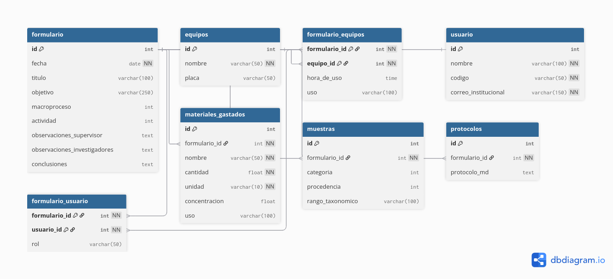

# MicrapDB
Pagina web del semillero de microbiologia de la universidad distrital destinados a organizar la información de las colecciones microbioligacas del cepario, y dar a conocer los proyectos que se estan desarrollando dentro del mismo.

### Script para la base de datos
``` sql
-- 1. Tabla base: usuario
CREATE TABLE usuario (
    id SERIAL PRIMARY KEY,
    nombre VARCHAR(100) NOT NULL,
    codigo VARCHAR(50) UNIQUE NOT NULL,
    correo_institucional VARCHAR(150) UNIQUE NOT NULL
);

-- 2. Tabla base: equipos
CREATE TABLE equipos (
    id SERIAL PRIMARY KEY,
    nombre VARCHAR(50) NOT NULL,
    placa VARCHAR(50) UNIQUE
);

-- 3. Tabla principal: formulario
CREATE TABLE formulario (
    id SERIAL PRIMARY KEY,
    fecha DATE NOT NULL,
    titulo VARCHAR(100),
    objetivo VARCHAR(250),
    macroproceso INT,
    actividad INT,
    observaciones_supervisor TEXT,
    observaciones_investigadores TEXT,
    conclusiones TEXT
);

-- 4. Tabla dependiente: formulario_equipos (N:M)
CREATE TABLE formulario_equipos (
    formulario_id INT REFERENCES formulario(id) ON DELETE CASCADE,
    equipo_id INT REFERENCES equipos(id) ON DELETE CASCADE,
    hora_de_uso TIME,
    uso VARCHAR(100),
    PRIMARY KEY (formulario_id, equipo_id)
);

-- 5. Tabla dependiente: formulario_usuario (N:M)
CREATE TABLE formulario_usuario (
    formulario_id INT REFERENCES formulario(id) ON DELETE CASCADE,
    usuario_id INT REFERENCES usuario(id) ON DELETE CASCADE,
    rol VARCHAR(50), -- Ej: 'investigador', 'supervisor'
    PRIMARY KEY (formulario_id, usuario_id)
);

-- 6. Tabla dependiente: materiales_gastados
CREATE TABLE materiales_gastados (
    id SERIAL PRIMARY KEY,
    formulario_id INT REFERENCES formulario(id) ON DELETE CASCADE,
    nombre VARCHAR(50) NOT NULL,
    cantidad FLOAT NOT NULL CHECK (cantidad > 0),
    unidad VARCHAR(10) NOT NULL, -- g, L, ml
    concentracion FLOAT CHECK (concentracion > 0),
    uso VARCHAR(100)
);

-- 7. Tabla dependiente: muestras
CREATE TABLE muestras (
    id SERIAL PRIMARY KEY,
    formulario_id INT REFERENCES formulario(id) ON DELETE CASCADE,
    categoria INT,    -- 1. Cepas puras ref., 2. Cepas proyecto, 3. Sin aislar, 4. Reactivo
    procedencia INT,  -- 1. Ambiental, 2. Animal, 3. Humana, 4. Superficies no clínicas, 5. Clínicas
    rango_taxonomico VARCHAR(100)
);

-- 8. Tabla dependiente: protocolos
CREATE TABLE protocolos (
    id SERIAL PRIMARY KEY,
    formulario_id INT REFERENCES formulario(id) ON DELETE CASCADE,
    protocolo_md TEXT -- Guardar contenido Markdown
);
```
### Diagrama de la base de datos


